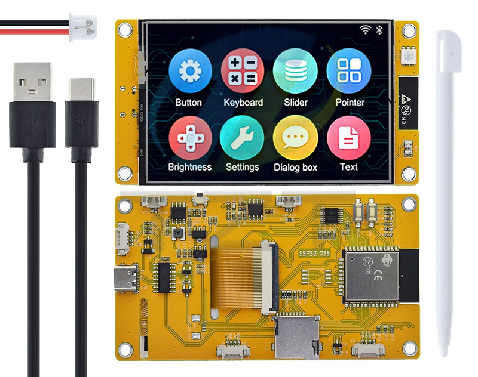
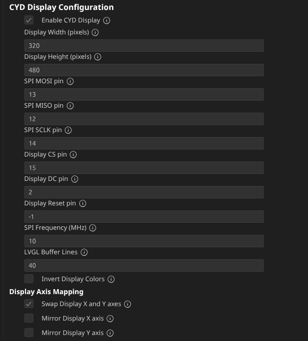
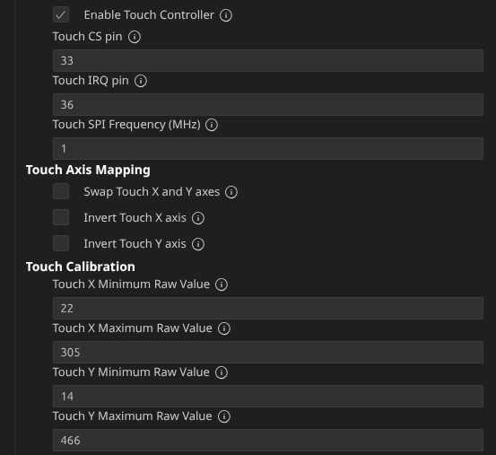
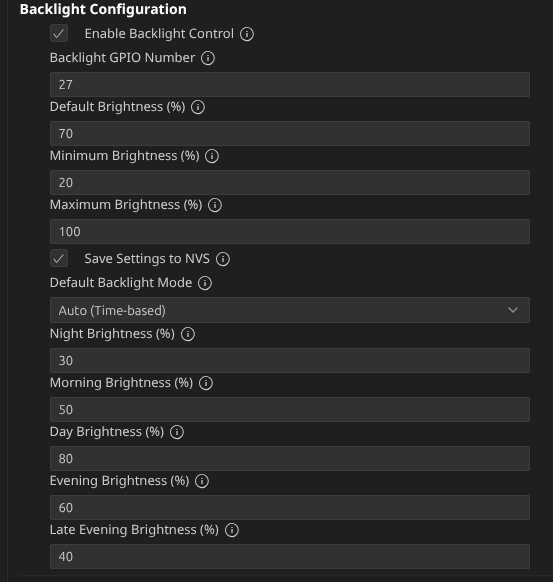
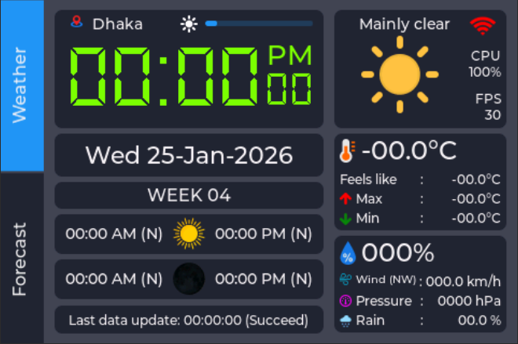
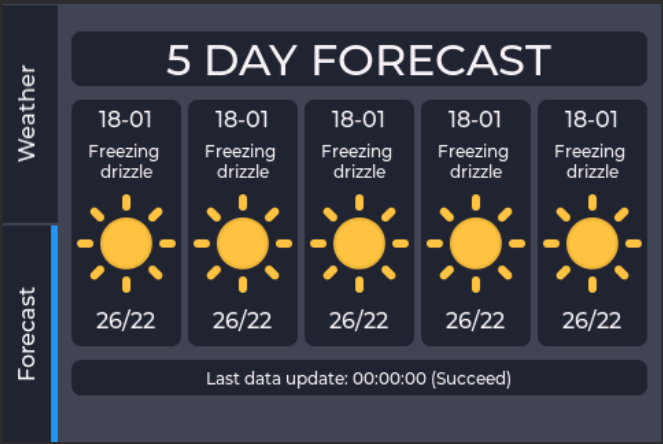

# 🌤️ CYD Weather Clock

A modern **ESP32 Cheap Yellow Display (CYD)** based **Weather + Clock System** built using **ESP-IDF v5.x** and **LVGL 8.x**.

This project transforms the ESP32 CYD board into a smart desktop device that displays:

✅ Real-time clock with NTP synchronization  
✅ Current weather conditions with icons  
✅ 5-day weather forecast  
✅ Sunrise/sunset and moon phases  
✅ WiFi provisioning with QR code (only when disconnected)  
✅ Touch-based interface with brightness control  
✅ Automatic brightness adjustment based on time of day  

---

## 📸 Preview

### 🖥️ CYD Hardware (ST7796S)


### ⚙️ Display Configuration


### ✋ Touch Configuration


### 👆 Brightness Configuration


### 🚀 Startup Screen


### 🕒 Home Screen


### 🌦️ Forecast Screen


### 📶 WiFi Provisioning


---

## ✨ Features

### Core Functionality
- 🕒 **NTP-synchronized digital clock** with automatic timezone handling (12h/24h format)
- 🌦️ **Live weather data** from Open-Meteo API (free, no API key required for weather)
- 📶 **WiFi provisioning system** with QR code support - **Only activates when WiFi is disconnected or connecting**
- 📱 **Touch UI** using LVGL 8.x with multi-screen navigation
- 🔄 **Auto reconnect WiFi** with exponential backoff
- 🌙 **Astronomical data** - Sunrise/sunset, moonrise/moonset, moon phases (Visual Crossing API - requires key)
- 📊 **5-day weather forecast** with icons and temperature ranges
- 📈 **FPS counter** and **CPU usage monitoring** for performance tuning

### Smart Display Control
- 💡 **Automatic brightness control** based on time of day (configurable presets)
- 👆 **Manual brightness control** with step adjustment (0% → 20% → 40% → 60% → 80% → 100%)
- 🔆 **PWM dimming** support for smooth backlight control
- 💾 **NVS storage** for persistent brightness and mode settings
- 🔄 **Hourly auto-brightness timer** - Automatically adjusts at each hour change

### WiFi & Provisioning (Unified Component)
- 📶 **Provisioning only available** when WiFi is disconnected or in connecting state
- ✅ **WiFi icon disabled** when already connected - prevents accidental reprovisioning
- 🔄 **Auto-reconnect** with exponential backoff (1s → 5s → 10s → 30s) - always retries with provisioned credentials
- 💾 **Credential storage** in NVS for persistent WiFi settings
- 📱 **Provisioning success/failure callbacks** for UI integration
- 🔐 **SoftAP provisioning** with QR code support using ESP-IDF provisioning manager
- ⏱️ **Automatic daily time sync** to maintain accuracy

### Astronomical Display Features
- 🌓 **Moon phase visualization** with 8 distinct phase icons
- ⏰ **Smart time display** with (N) indicators for next day events
- 🔄 **Automatic midnight rollover** - Updates astronomical data at day change
- ⏱️ **30-second indicator updates** for accurate (N) indicators

---

## 🧠 Hardware

### Supported Boards
| Board | Display | Touch | Status |
|-------|---------|-------|--------|
| ESP32-3248S035 | ST7796S (480x320) | XPT2046 | ✅ Tested |
| ESP32-E32R35T | ST7796S (480x320) | XPT2046 | ✅ Tested |
| Generic CYD | ST7796S/ILI9488 | XPT2046 | ⚠️ May need pin config |

### Specifications
- **Display**: 480x320 TFT with ST7796S driver
- **Touch**: XPT2046 resistive touch controller
- **Wireless**: Built-in WiFi and Bluetooth
- **Interface**: SPI for display and touch
- **Backlight**: PWM controlled (GPIO 12/27) with NVS storage

### Pin Configuration (Default CYD)
| Function | GPIO Pin |
|----------|----------|
| Display CS | 15 |
| Display DC | 2 |
| Display RST | -1 |
| Display BL | 27 |
| Touch CS | 33 |
| Touch IRQ | 36 |
| SPI MOSI | 13 |
| SPI MISO | 12 |
| SPI SCK | 14 |

### Configurable Pin Mapping
All pins are configurable via `menuconfig` under **CYD Display Configuration** for custom hardware setups.

---

## 🏗️ Project Architecture

```
cyd-weather-clock/
│
├── main/
│   ├── main.c                 # Application entry point with UI coordination
│   ├── CMakeLists.txt          # Component registration with UI sources
│   └── ui/                    # LVGL GUI (SquareLine Studio export)
│       ├── ui.c
│       ├── ui.h
│       ├── ui_events.c
│       ├── ui_events.h
│       ├── ui_helpers.c
│       ├── ui_helpers.h
│       ├── ui_images.h
│       ├── screens/
│       │   ├── ui_Main.c
│       │   ├── ui_Main.h
│       │   ├── ui_Provision.c
│       │   ├── ui_Provision.h
│       │   ├── ui_Forecast.c
│       │   └── ui_Forecast.h
│       ├── components/         # Weather and UI components
│       ├── fonts/              # Weather and UI fonts
│       └── images/             # Weather and UI icons
│
├── components/
│   ├── cyd_display/            # CYD specific display driver
│   │   ├── cyd_display.c       # Display, touch, backlight control
│   │   ├── cyd_display.h       # Public API
│   │   ├── Kconfig             # Display configuration options
│   │   └── CMakeLists.txt
│   │
│   ├── wifi_clock/             # UNIFIED WiFi + Provisioning component
│   │   ├── wifi_clock.c        # WiFi management, NTP sync, provisioning
│   │   ├── wifi_clock.h        # Public API
│   │   ├── Kconfig             # WiFi & provisioning configuration
│   │   └── CMakeLists.txt
│   │
│   ├── weather/                 # Weather API handling
│   │   ├── weather.c            # Open-Meteo + Visual Crossing APIs
│   │   ├── weather.h            # Public API
│   │   ├── Kconfig              # Weather configuration
│   │   └── CMakeLists.txt
│   │
│   ├── lvgl/                    # LVGL library
│   │
│   ├── esp_lcd_st7796/          # ESP LCD ST7796 driver (SPI && I80 && MIPI DSI)
│   │
│   ├── esp_lcd_touch_xpt2046/   # esp_lcd_touch driver for XPT2046 touch controllers
│   │
│   └── cjson/                   # cJSON library
│
├── managed_components/
│   ├── espressif__cmake_utilities/   # ESP CMake Utility library
│   └── espressif__esp_lcd_touch/     # ESP LCD Touch library
│
├── docs/
│   └── images/                       # README screenshots
│
├── sdkconfig
├── sdkconfig.defaults
├── CMakeLists.txt
├── README.md
├── partitions.csv
└── .gitignore
```

### Component Overview

| Component | Header File | Description |
|-----------|-------------|-------------|
| **cyd_display** | `cyd_display.h` | CYD-specific display initialization, touch, backlight |
| **wifi_clock** | `wifi_clock.h` | **UNIFIED**: WiFi connection, NTP sync, status management, SoftAP provisioning with QR code |
| **weather** | `weather.h` | Weather data structures and API functions |
| **ui** | `ui.h`, `ui_helpers.h` | LVGL screens and event handlers |

### Kconfig Files

| Component | Kconfig | Configuration Options |
|-----------|---------|----------------------|
| **cyd_display** | `components/cyd_display/Kconfig` | SPI pins, orientation, backlight presets |
| **wifi_clock** | `components/wifi_clock/Kconfig` | **UNIFIED**: WiFi SSID/password, NTP servers, timezone, AP SSID, security, timeout, auto-reconnect, daily sync |
| **weather** | `components/weather/Kconfig` | Lat/lon, update intervals, API keys |

---

## ⚙️ Development Environment

### Required Tools
- **ESP-IDF v5.x** - Espressif IoT Development Framework
- **Python 3.10+** - For build scripts
- **Git** - Version control
- **VSCode** (recommended) - With ESP-IDF extension
- **SquareLine Studio** (optional) - For UI editing

### Install ESP-IDF
```bash
git clone -b v5.1 https://github.com/espressif/esp-idf.git
cd esp-idf
./install.sh
. ./export.sh
```

---

## 🚀 Build & Flash

### Clone the Project
```bash
git clone https://github.com/mshs013/cyd-weather-clock.git
cd cyd-weather-clock
```

### Configure
```bash
idf.py menuconfig
```

Navigate to key configuration sections:
- **CYD Display Configuration** - SPI pins, backlight settings, orientation
- **WiFi Clock Configuration** - **UNIFIED**: Set WiFi defaults, timezone, NTP servers, provisioning AP settings
- **Weather Configuration** - Set latitude/longitude, update intervals, API keys

### Build System Features
The main component uses automatic UI source inclusion:
```cmake
file(GLOB_RECURSE UI_SOURCES "ui/*.c")
idf_component_register(SRCS "main.c" ${UI_SOURCES}
                    INCLUDE_DIRS "." "ui"
                    PRIV_REQUIRES spi_flash cyd_display wifi_clock weather)

# Optimize binary size by removing unused sections
target_link_options(${COMPONENT_LIB} PRIVATE 
    "-Wl,--gc-sections"
    "-Wl,--strip-all"
)
```

Benefits:
- ✅ All UI files automatically included without manual listing
- ✅ Clean component dependency management
- ✅ Optimized binary size with dead code elimination
- ✅ **Unified WiFi component** - Single dependency for all WiFi needs

### Build
```bash
idf.py build
```

### Flash and Monitor
```bash
idf.py -p /dev/ttyUSB0 flash monitor
```

Press `Ctrl+]` to exit monitor.

### Clean Build (if needed)
```bash
idf.py clean
idf.py fullclean
```

---

## 📶 WiFi & Provisioning (Unified Component)

### ⚠️ Important: Provisioning Behavior
The WiFi provisioning **only activates when the device is disconnected or in the process of connecting**. This prevents accidental reprovisioning when WiFi is already working.

### When Can You Provision?
| WiFi Status | Provisioning Available? |
|-------------|------------------------|
| **Disconnected** | ✅ Yes - Tap WiFi icon to start |
| **Connecting** | ✅ Yes - Tap WiFi icon to start |
| **Connected** | ❌ No - WiFi icon shows "Already Connected" message |
| **Time Synced** | ❌ No - WiFi icon disabled |

### Steps to Provision:
1. **Ensure** device is not connected to WiFi
2. **Tap** the WiFi icon in the top-left corner
3. Device creates a SoftAP: `WIFI_CLOCK_PROV` (or configured name)
4. **Connect** your phone/computer to this WiFi network
5. **Scan** the QR code displayed on the screen using the ESP SoftAP Provisioning app
6. **Enter** your home WiFi credentials in the provisioning app
7. Device **connects automatically** and saves credentials to NVS
8. **Returns** to main screen with WiFi connected

### QR Code Format
```json
{"ver":"v1","name":"WIFI_CLOCK_PROV","pop":"optional_password","transport":"softap"}
```

### Provisioning Events
- **Started**: "Waiting for credentials..."
- **Success**: Auto-returns to main screen with WiFi ON icon
- **Failed**: Shows error message, allows retry

### WiFi Auto-Reconnect Behavior
- **Always retries** when provisioned credentials exist (regardless of auto-reconnect setting)
- **Exponential backoff**: 1s → 5s → 10s → 30s
- **Resets retry counter** on successful connection
- **Persistent credentials** stored in NVS

### NTP Time Synchronization
- **Automatic sync** when WiFi connects
- **Daily resync** at configurable time (default 03:00)
- **Manual sync** option available
- **Timezone support** with POSIX conversion

---

## 🌦️ Weather Configuration

### Open-Meteo API (Free, No API Key Required for Weather)
Configure in `menuconfig`:
```
Component config → Weather Configuration
├── Enable weather (CONFIG_WEATHER_ENABLE)
├── Latitude (e.g., 23.8103 for Dhaka)
├── Longitude (e.g., 90.4125 for Dhaka)
├── Timezone (e.g., Asia/Dhaka)
├── Update interval (minutes) - How often to refresh current weather
└── Forecast update time (HH:MM) - Daily forecast refresh time
```

### Astronomical Data (Visual Crossing API - Requires Key)
For sunrise/sunset and moon phases:
```
Component config → Weather Configuration → Astronomical Configuration
├── API Key (Get from visualcrossing.com)
├── City name (e.g., Dhaka)
├── Timezone (e.g., Asia/Dhaka)
└── Update time (HH:MM) - Daily astronomical refresh time
```

### Weather Update Schedule
- **Current Weather**: Every 5-30 minutes (configurable)
- **5-day Forecast**: Daily at configured time (default 06:00)
- **Astronomical Data**: Daily at configured time (default 00:05)
- **Midnight Rollover**: Automatically updates next day events

### Weather Codes & Icons
| Code | Description | Day Icon | Night Icon |
|------|-------------|----------|------------|
| 0 | Clear sky | ☀️ 01d | 🌙 01n |
| 1 | Mainly clear | ⛅ 02d | ☁️ 02n |
| 2 | Partly cloudy | ⛅ 03d | ☁️ 03n |
| 3 | Overcast | ☁️ 04d | ☁️ 04n |
| 45-48 | Fog | 🌫️ 50d | 🌫️ 50n |
| 51-55 | Drizzle | 🌧️ 09d | 🌧️ 09n |
| 56-57 | Freezing drizzle | ❄️ 13d | ❄️ 13n |
| 61-65 | Rain | 🌧️ 10d | 🌧️ 10n |
| 66-67 | Freezing rain | ❄️ 13d | ❄️ 13n |
| 71-75 | Snow fall | ❄️ 13d | ❄️ 13n |
| 77 | Snow grains | ❄️ 13d | ❄️ 13n |
| 80-82 | Rain showers | 🌧️ 09d | 🌧️ 09n |
| 85-86 | Snow showers | ❄️ 13d | ❄️ 13n |
| 95 | Thunderstorm | ⛈️ 11d | ⛈️ 11n |
| 96-99 | Thunderstorm with hail | ⛈️ 11d | ⛈️ 11n |

---

## 💡 Backlight Control

### Modes
| Mode | Description | Behavior |
|------|-------------|----------|
| **Manual** | User controlled | Tap brightness icon to toggle, drag slider to adjust |
| **Auto (Time-based)** | Automatic | Adjusts at hour changes based on time of day |

### Time-based Brightness Presets (Configurable)
| Time Period | Default Brightness |
|-------------|-------------------|
| Night (22:00-06:00) | 10% |
| Morning (06:00-08:00) | 30% |
| Day (08:00-18:00) | 80% |
| Evening (18:00-20:00) | 50% |
| Late Evening (20:00-22:00) | 25% |

### Automatic Timer
- **Hourly adjustment** at `:00` minutes
- **Immediate adjustment** when switching to Auto mode
- **Time sync trigger** - Adjusts when NTP time is first synced

### Controls
- **Tap brightness icon** - Toggle between Auto and Manual mode
- **Drag brightness bar** - Adjust brightness (only in Manual mode)
- **Settings saved** automatically to NVS
- **Step adjustment** - 0% → 20% → 40% → 60% → 80% → 100%

---

### Touch Controls
| UI Element | Action | Result |
|------------|--------|--------|
| WiFi icon | Tap | Open provisioning screen (only if disconnected) |
| Brightness icon | Tap | Toggle auto/manual mode |
| Brightness bar | Drag | Adjust brightness (manual mode only) |

---

## 🔧 Configuration Options

### Menuconfig Settings
Open with `idf.py menuconfig`

#### CYD Display Configuration
```
Component config → CYD Display Configuration
├── Display SPI MOSI (GPIO 13)
├── Display SPI MISO (GPIO 12)
├── Display SPI SCK (GPIO 14)
├── Display CS (GPIO 15)
├── Display DC (GPIO 2)
├── Display RST (GPIO -1)
├── Display Backlight (GPIO 27)
├── Touch CS (GPIO 33)
├── Touch IRQ (GPIO 36)
├── Display Orientation (LANDSCAPE)
├── Swap XY (Enable for portrait)
├── Mirror X/Y
└── Invert colors (if needed)
```

#### WiFi Clock Configuration (UNIFIED)
```
Component config → WiFi Clock Configuration
├── WiFi Settings
│   ├── WiFi SSID (default fallback)
│   ├── WiFi Password (default fallback)
│   ├── Hostname (cyd-clock)
│   ├── Enable auto-reconnect (YES)
│   └── Power save mode (WIFI_PS_NONE)
│
├── Time Settings
│   ├── Timezone (Asia/Dhaka)
│   ├── Time Format (12h/24h)
│   ├── NTP Server 1 (pool.ntp.org)
│   ├── NTP Server 2 (time.google.com)
│   ├── NTP Server 3 (time.windows.com)
│   ├── Enable daily sync (YES)
│   └── Daily sync time (03:00)
│
├── Provisioning Settings
│   ├── Provisioning AP SSID (WIFI_CLOCK_PROV)
│   ├── AP Security (WIFI_PROV_SEC_1)
│   ├── AP Password (optional)
│   ├── Max retries (5)
│   └── Provisioning timeout (300 seconds)
│
└── Task Configuration
    ├── Stack size (4096)
    ├── Priority (5)
    └── Core ID (1)
```

#### Weather Configuration
```
Component config → Weather Configuration
├── Enable weather (YES)
├── Latitude (23.8103)
├── Longitude (90.4125)
├── Timezone (Asia/Dhaka)
├── Update interval (15 minutes)
├── Forecast update time (06:00)
├── Astronomical Configuration
│   ├── API Key (your_key_here)
│   ├── City name (Dhaka)
│   ├── Timezone (Asia/Dhaka)
│   └── Update time (00:05)
└── Task Configuration
    ├── Stack size (4096)
    ├── Priority (2)
    └── Core ID (1)
```

---

## 🧪 Troubleshooting

### WiFi & Provisioning Issues
| Problem | Solution |
|---------|----------|
| **WiFi icon does nothing** | Check if WiFi is already connected - provisioning only works when disconnected |
| **"Wi-Fi already Connected" message** | This is normal - disconnect first if you need to reprovision |
| **Provisioning starts but never completes** | Check phone is connected to device AP, verify password |
| **QR code not showing** | Check if provisioning started correctly, verify display initialization |
| **Can't find SoftAP** | Wait 2-3 seconds after tapping icon, scan again |
| **Provisioning success but no connection** | Check credentials, router compatibility |
| **WiFi won't reconnect** | Check if credentials are saved in NVS, verify router signal |
| **Time never syncs** | Check NTP server reachability, verify timezone setting |

### Display Issues
| Symptom | Solution |
|---------|----------|
| **White screen** | Check SPI pins (CS, DC, RST), verify power, check display driver initialization |
| **Flickering** | Adjust LVGL tick timer period (should be 10ms), increase display buffer size |
| **Wrong colors** | Verify color depth setting (16-bit RGB565), check display initialization sequence |
| **No backlight** | Check BL pin (GPIO 27), verify PWM configuration, test with GPIO simple mode |

### WiFi Connection Problems
| Issue | Solution |
|-------|----------|
| **No AP found** | Check antenna connection, verify router is on 2.4GHz, increase scan time |
| **Authentication failed** | Verify password, check security mode (WPA2-PSK recommended) |
| **DHCP timeout** | Check router DHCP server, try static IP configuration |
| **NTP sync fails** | Try different NTP servers, check firewall, verify timezone setting |

### Touch Issues
| Problem | Fix |
|---------|-----|
| **No touch response** | Check XPT2046 pins (CS, IRQ), verify SPI speed (2MHz recommended) |
| **Inaccurate touches** | Check pressure threshold (400 recommended), verify calibration |
| **Ghost touches** | Increase debounce time, check grounding, add capacitor on touch lines |

### Weather API
| Error | Cause | Fix |
|-------|-------|-----|
| **HTTP 400** | Invalid parameters | Check latitude/longitude format (use decimal, e.g., 23.8103) |
| **HTTP 401** | API key invalid | Verify Visual Crossing API key (for astronomical data only) |
| **No data** | Network issue | Check WiFi connection, verify API endpoint is reachable |
| **Parse error** | API format changed | Update JSON parser, check for API changes |

### Build Issues
| Problem | Solution |
|---------|----------|
| **UI files not found** | Ensure `GLOB_RECURSE` pattern matches your UI directory structure |
| **Linker errors** | Check component dependencies in `PRIV_REQUIRES` |
| **Binary too large** | `--gc-sections` and `--strip-all` flags help reduce size |
| **Undefined references** | Verify all required components are listed in `PRIV_REQUIRES` |

### Debug Commands
```bash
# Monitor with all debug output
idf.py monitor

# Filter specific components
idf.py monitor | grep -E "MAIN|WEATHER|WIFI|CYD_DISPLAY|PROV"

# Check free memory
# In monitor, type: free

# Check tasks
# In monitor, type: ps

# Check WiFi status
# In monitor, type: wifi status
```

---

## 📊 Performance Metrics

| Metric | Value |
|--------|-------|
| **LVGL FPS** | 50-60 fps (smooth) |
| **Boot time** | ~2-3 seconds |
| **WiFi connection** | 2-5 seconds |
| **NTP sync** | 1-2 seconds |
| **Weather update** | 1-3 seconds |
| **RAM usage** | ~400KB (of ~4MB) |
| **Flash usage** | ~2.5MB (Optimized with GC sections) |
| **Power consumption** | 80-150mA (depending on brightness) |

---

## 🔄 Update Schedule

| Data Type | Update Frequency |
|-----------|------------------|
| **Clock display** | 100ms (UI refresh) |
| **Current weather** | Every 5-30 minutes (configurable) |
| **5-day forecast** | Daily at configured time (default 06:00) |
| **Astronomical data** | Daily at configured time (default 00:05) |
| **Brightness (auto mode)** | Every hour (at :00 minutes) |
| **WiFi reconnect** | Exponential backoff (1s → 5s → 10s → 30s) |
| **NTP daily sync** | Daily at configured time (default 03:00) |
| **(N) Indicators** | Every 30 seconds (day change detection) |

---

## 🗺️ Roadmap

### Planned Features
- [ ] **OTA Updates** - Wireless firmware updates from GitHub
- [ ] **Home Assistant Integration** - MQTT connectivity for smart home
- [ ] **Multiple Cities** - Weather for different saved locations
- [ ] **Alarm Clock** - With touch snooze and custom sounds
- [ ] **Weather Graphs** - Temperature and pressure trends
- [ ] **Swipe Navigation** - Switch between screens with gestures
- [ ] **Sleep Mode** - Deep sleep between updates for battery operation

### Recent Updates (v0.2)
- ✅ **Modular component structure** - Separated display, WiFi, and weather logic
- ✅ **Unified WiFi component** - Merged WiFi management and provisioning into single component
- ✅ **Automated UI source inclusion** - Using `GLOB_RECURSE` for easier maintenance
- ✅ **Binary size optimization** - Added linker flags to strip unused sections
- ✅ **CYD-specific display driver** - Streamlined hardware initialization
- ✅ **Smart astronomical display** - (N) indicators for next day events
- ✅ **Hourly auto-brightness timer** - Precise time-based adjustments
- ✅ **Robust provisioning callbacks** - Smooth UI transitions during provisioning
- ✅ **Auto-reconnect with provisioned credentials** - Always retries when credentials exist
- ✅ **Removed legacy components**: `lvgl_esp32_drivers`, `backlight`, and `lv_port` (functionality merged into `cyd_display`)

---

## 🤝 Contributing

Contributions are welcome! Here's how you can help:

1. **Fork** the repository
2. **Create** a feature branch (`git checkout -b feature/AmazingFeature`)
3. **Commit** your changes (`git commit -m 'Add some AmazingFeature'`)
4. **Push** to the branch (`git push origin feature/AmazingFeature`)
5. **Open** a Pull Request

### Coding Guidelines
- Follow ESP-IDF coding style
- Add comments for complex logic
- Test on actual hardware when possible
- Update documentation for new features
- Ensure build system changes maintain compatibility

---

## 📜 License

MIT License

Copyright (c) 2026 Sazzad Hossain

Permission is hereby granted, free of charge, to any person obtaining a copy
of this software and associated documentation files (the "Software"), to deal
in the Software without restriction, including without limitation the rights
to use, copy, modify, merge, publish, distribute, sublicense, and/or sell
copies of the Software, and to permit persons to whom the Software is
furnished to do so, subject to the following conditions:

The above copyright notice and this permission notice shall be included in all
copies or substantial portions of the Software.

THE SOFTWARE IS PROVIDED "AS IS", WITHOUT WARRANTY OF ANY KIND, EXPRESS OR
IMPLIED, INCLUDING BUT NOT LIMITED TO THE WARRANTIES OF MERCHANTABILITY,
FITNESS FOR A PARTICULAR PURPOSE AND NONINFRINGEMENT. IN NO EVENT SHALL THE
AUTHORS OR COPYRIGHT HOLDERS BE LIABLE FOR ANY CLAIM, DAMAGES OR OTHER
LIABILITY, WHETHER IN AN ACTION OF CONTRACT, TORT OR OTHERWISE, ARISING FROM,
OUT OF OR IN CONNECTION WITH THE SOFTWARE OR THE USE OR OTHER DEALINGS IN THE
SOFTWARE.

---

## 👨‍💻 Author

**Sazzad Hossain**  
Embedded Systems Developer | IoT Enthusiast | ESP32 Specialist

- **GitHub**: [@mshs013](https://github.com/mshs013)
- **Email**: mshs013@gmail.com
- **Location**: Dhaka, Bangladesh

### Skills
- ESP32, ESP-IDF, Arduino
- LVGL GUI Development
- WiFi, Bluetooth, MQTT
- RTOS, FreeRTOS
- C/C++, Python
- IoT and Embedded Systems

---

## 🙏 Acknowledgments

- **ESP-IDF Team** - Excellent IoT development framework
- **LVGL Team** - Beautiful embedded graphics library
- **Open-Meteo** - Free weather API (no key required for weather!)
- **Visual Crossing** - Weather data API for astronomical information
- **CYD Community** - Hardware support and inspiration
- **SquareLine Studio** - UI design tool

---

## 📞 Support

If you encounter any issues or have questions:

1. **Check** the troubleshooting section above
2. **Search** existing GitHub Issues
3. **Open** a new issue with detailed description
4. **Include** serial monitor output when reporting bugs

---

## ⭐ Show Your Support

If you find this project useful:

- ⭐ **Star** this repository on GitHub
- 🍴 **Fork** it for your own projects
- 📢 **Share** with the maker community
- 🐛 **Report** issues and suggest features

---

## 📝 Quick Start Summary

```bash
# 1. Install ESP-IDF
git clone -b v5.1 https://github.com/espressif/esp-idf.git
cd esp-idf
./install.sh
. ./export.sh

# 2. Clone this project
cd ~
git clone https://github.com/mshs013/cyd-weather-clock.git
cd cyd-weather-clock

# 3. Configure
idf.py menuconfig
# Set your WiFi, weather location, API keys, display pins, etc.

# 4. Build and flash
idf.py build
idf.py -p /dev/ttyUSB0 flash monitor

# 5. Enjoy your smart weather clock!
```

---

**Happy Building!** 🚀

---

*Last Updated: March 13, 2026*